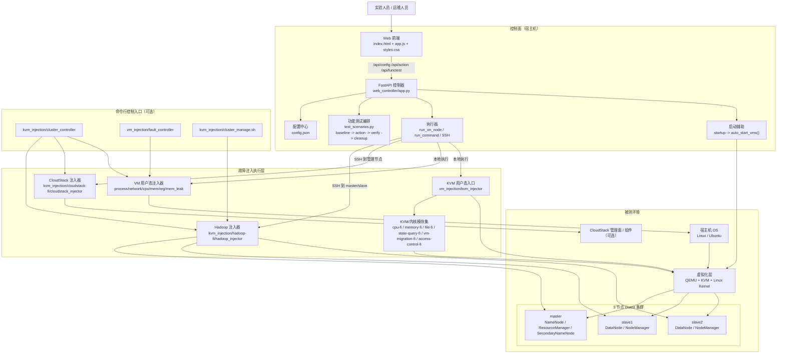
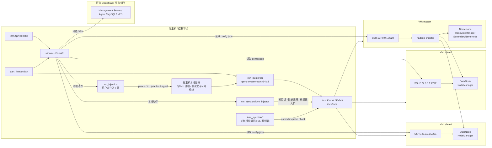

# 系统架构图

本文档基于当前仓库实现梳理整个故障注入平台的系统架构，重点覆盖 `web_controller`、`vm_injection`、`kvm_injection`、QEMU/KVM 虚拟化环境以及 Hadoop/CloudStack 被测对象之间的关系。

## 1. 总体逻辑架构图

## 2. 部署与执行路径图

## 3. 模块职责对应

- `web_controller`
  - 提供统一 Web 控制台、动作接口、功能测试接口、健康检查接口。
  - 通过 `config.json` 决定节点拓扑、SSH 连接方式和工具二进制路径。
  - 将请求分发为两类执行路径：本地执行、远程 SSH 执行。

- `kvm_injection`
  - 提供面向 Hadoop/CloudStack 的用户态注入器。
  - 提供面向 KVM/内核的模块源码与统一 CLI 控制器。
  - 适合宿主机级、虚拟化层级、管理平面级故障注入。

- `vm_injection`
  - 提供进程、网络、CPU、内存、寄存器等 Guest/用户态注入器。
  - 既可作用于虚拟机内部业务进程，也可在宿主机上针对 QEMU 相关进程做干预。

- `run_cluster.sh` 与 `start_frontend.sh`
  - 负责拉起 3 节点 QEMU 集群与 Web 控制器。
  - 当前默认通过宿主机端口转发 `2220/2221/2222` 访问三台 VM。

## 4. 当前实现下的关键控制流

1. 用户在浏览器中发起注入或功能测试。
2. 前端调用 FastAPI 的 `/api/action` 或 `/api/functest`。
3. 后端按 `ACTIONS` 或 `FUNC_TESTS` 解析参数、选择目标节点、决定是否加 `sudo`。
4. Hadoop/CloudStack 动作通常通过 SSH 落到远端节点执行。
5. VM/KVM 动作通常在宿主机本地执行注入器。
6. 执行结果被裁剪、结构化后返回前端展示。

## 5. 建图说明

- 图中同时保留了 Web 控制路径和 CLI 控制路径，因为这两条路径在仓库中都是真实存在的入口。
- CloudStack 在当前仓库中属于可选被测对象，因此在部署图中单独作为可选区域表示。
- KVM 故障注入实际分为“用户态入口工具”和“内核模块 Hook 点”两层，图中已拆开表示。
