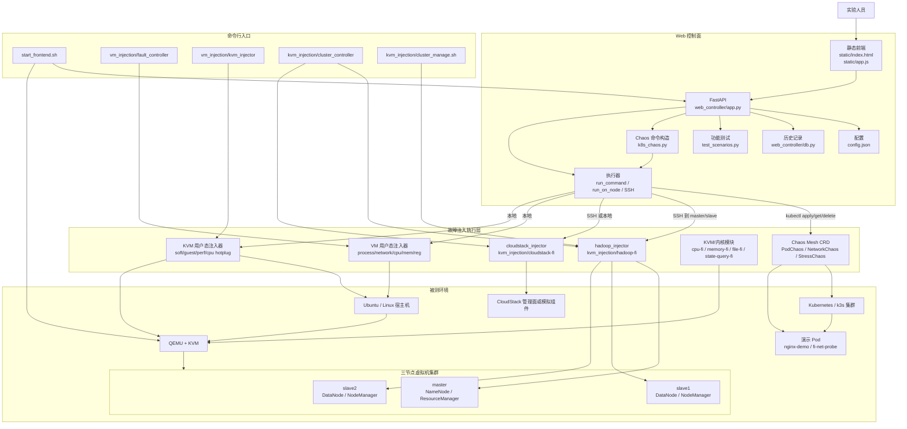
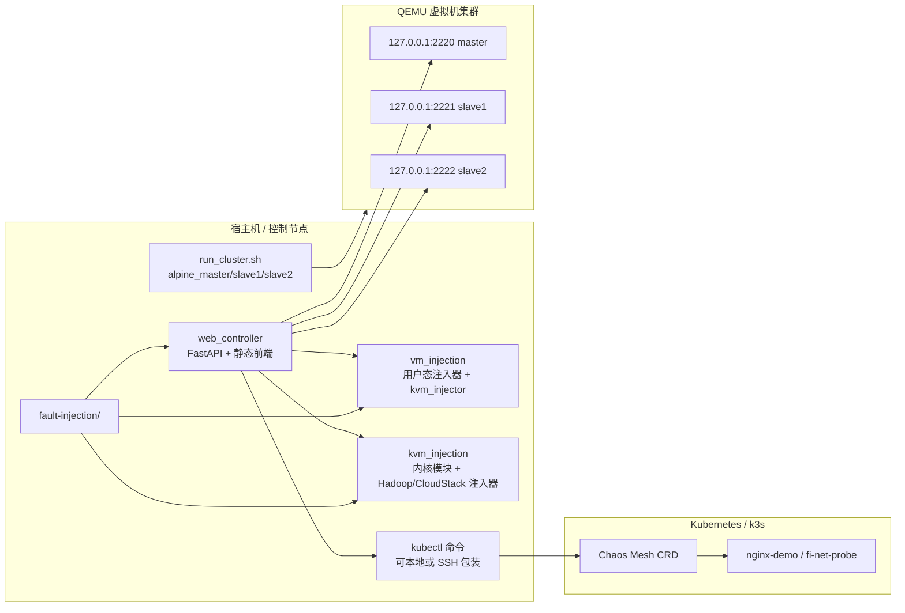

# 系统架构图

本文档按当前代码梳理平台架构，覆盖 `web_controller`、Chaos Mesh、Hadoop、CloudStack、VM 注入、KVM 注入与 QEMU/KVM 被测环境。

## 1. 总体架构

## 2. 部署路径

## 3. 当前控制流

1. 用户在浏览器中选择单次动作或功能测试。
2. 前端调用 `/api/action` 或 `/api/functest`。
3. 后端读取 `config.json`，校验参数，决定作用域是本地、master、全部节点还是目标节点。
4. Chaos Mesh 动作由 `k8s_chaos.py` 生成 JSON manifest，再通过 `kubectl apply -f -` 下发。
5. Hadoop 动作通过 SSH 到 master 执行 `hadoop_injector`，部分命令再由该工具分发到 slave。
6. VM/KVM 动作在宿主机执行 `vm_injection` 下的二进制。
7. CloudStack 动作按 `config.json` 指定路径执行 `cloudstack_injector`。
8. 执行结果经 `sanitize_output` 和 `truncate_text` 裁剪后返回前端，并写入历史数据库。

## 4. 功能测试边界

当前 `test_scenarios.py` 最终导出的 `FUNC_TESTS` 包含：

- Chaos Mesh：Pod Kill、Container Kill、网络延迟、网络丢包、CPU 压力、内存压力。
- VM：进程、网络、CPU、内存泄漏、内存注入、寄存器注入。
- KVM：虚拟机列表、软错误、性能故障、CPU 热插拔、恢复。

Hadoop 和 CloudStack 的场景动作仍在 `ACTIONS` 中，但没有进入当前 `/api/functest` 的最终用例列表。需要自动化测试时，可继续在 `test_scenarios.py` 中把对应 group 加回 `FUNC_TESTS`。

## 5. 模块职责

| 模块 | 职责 |
| --- | --- |
| `web_controller/app.py` | API、动作定义、参数校验、执行分发、历史落库 |
| `web_controller/k8s_chaos.py` | 构造 Chaos Mesh manifest 和 kubectl 命令 |
| `web_controller/test_scenarios.py` | 定义功能测试的 baseline、action、verify、cleanup |
| `web_controller/db.py` | SQLite 历史记录 |
| `vm_injection/` | 用户态故障注入和 KVM 用户态入口 |
| `kvm_injection/hadoop-fi/` | Hadoop 业务语义故障注入 |
| `kvm_injection/cloudstack-fi/` | CloudStack 管理面故障注入 |
| `kvm_injection/*-fi/` | KVM/内核模块故障注入实验 |

## 6. 风险与恢复

- Chaos Mesh 实验结束后删除对应 CRD：`kubectl delete podchaos,networkchaos,stresschaos --all -n <namespace>`。
- Hadoop 网络类故障结束后执行 `delay-clear`、`loss-clear`、`reorder-clear`、`isolate-clear`。
- VM 网络类故障结束后执行 `network_injector 0`。
- KVM 性能和 CPU 热插拔故障结束后执行 `kvm_injector clear`。
- 内核模块实验结束后确认 `rmmod` 成功，并查看 `dmesg`。
